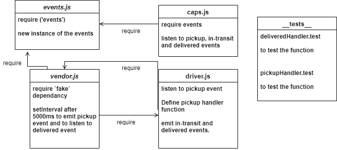

# EVENTS

### Deployment Test

Author: Nihad Zeidan

### tests report

[Heroku]()

[GitHub PR]()

[GitHub Actions]()

### .env requirements

storeName =

### Running the app

`npm start`

### Endpoints: 

### Output Objects

{
  Event: 'Event Name',
  Time: Time that of that event,

  Payload: {
    storeName: 'Store Name',
    orderId: Random number,
    customerName: 'random name',
    address: 'one of the jordanian cites'
  }

}

### Tests

Unit Tests: `npm run test`

UML

